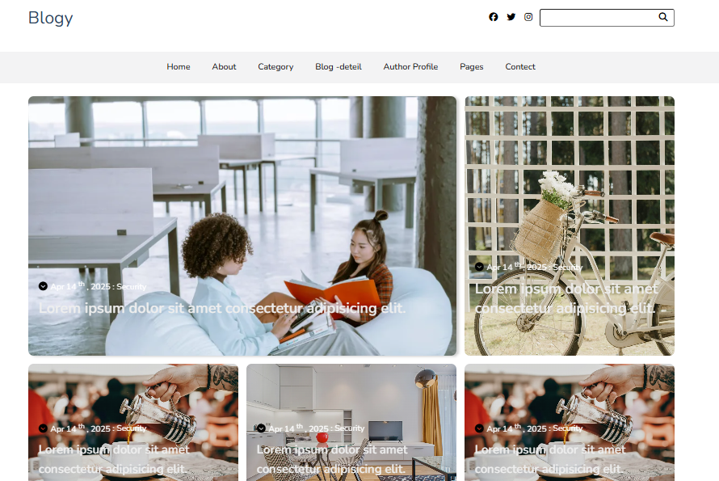

# Blogy Template Clone

This project is a **responsive blog website** clone based on the [Blogy Template](https://bootstrapmade.com/content/demo/Blogy/) by BootstrapMade. It was built using **HTML** and **CSS** only, with a focus on layout structure, responsiveness, and clean UI replication.

---

## 📍 Live Preview

🔗 [View the Website](https://blogy-zeta.vercel.app/index.html)

---

## 📸 Preview



---

## 📌 Features

- Responsive grid layout using CSS Grid
- Modern, clean blog UI
- Author profile,  Home Page, blog details, and category page
- Responsive sidebar and content sections
- Styled using Google Fonts and basic custom CSS

---

## 🛠️ Built With

- HTML5  
- CSS3  
- Google Fonts (Nunito, Poppins, Roboto)  
- Blogy Template (as design reference)

---

## 💡 Inspiration

This project was built as a learning exercise to:

- Practice teamwork and version control with GitHub
- Improve responsive layout design with CSS Grid and Flexbox
- Enhance skills in recreating UI from templates

---

## 🖥️ Pages Implemented

- ✅ Home Page  
- ✅ About Page  
- ✅ Category Page  
- ✅ Blog Details Page  
- ✅ Author Profile Page  
- ✅ Contact Page  

> 🔁 Work is split between team members using Git and GitHub.

---

## 🤝 Collaboration

We are collaborating on this project using Git and GitHub. Each member works on specific pages/sections, and we use Pull Requests to review and merge changes.

---


## 📁 Project Structure

```plaintext
project-folder/

├── index.html
├── category.html
├── blog-details.html
├── author.html
├── contact.html
├── css/
│   └── main.css
└── images/
